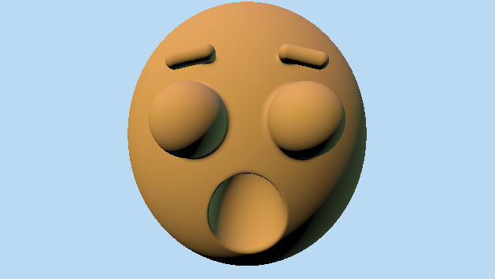
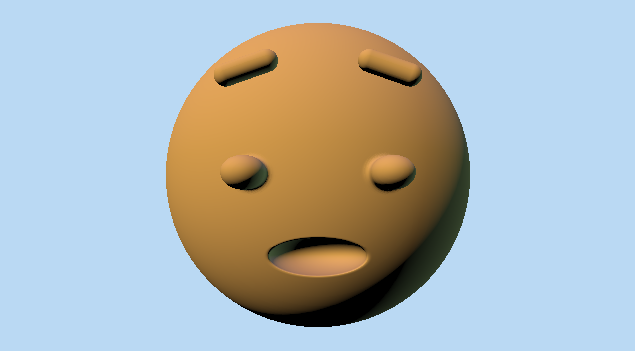
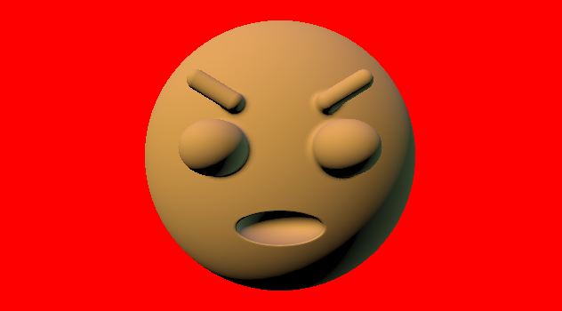

# lab06-proceduralFace - Annie Qiu

Let's practice parameterization! We'll be starting with an oh-so-beautiful gingerbread man face that looks like this:

## Result
[Shadertoy](https://www.shadertoy.com/view/lc3yR4)

### Original
SURPRISE: 0.0; SADNESS: 0.0; ANGRY:0.0;

### Task 1
In the faceSDF function, add a new float parameter called SUPRISE with a value between 0 and 1. 
SURPRISE: 1.0

### Task 2
In the faceSDF function, create a new float parameter called SADNESS with a value between 0 and 1.
SADNESS: 1.0

### Task 3
In the faceSDF function, create a new float parameter called ANGRY with a value between 0 and 1.
ANGRY: 1.0

